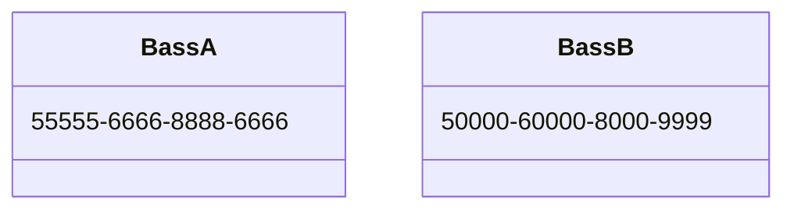
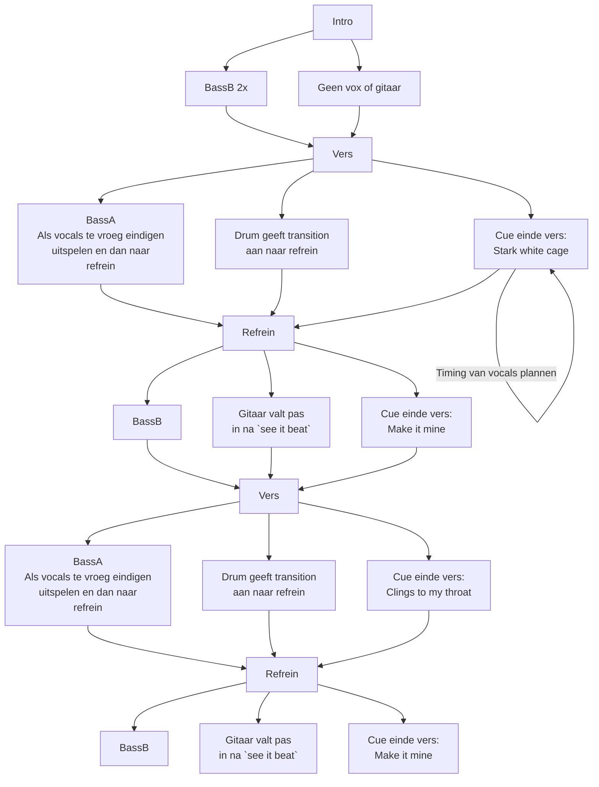

# Vivisection
[DEMO221122](https://drive.google.com/file/d/1sBwJH4VqllVOAX1VrNKggk24xGdJldg8/view?usp=share_link)

```mermaid
classDiagram
    class BassA{
      55555-6666-8888-6666
    }
    class BassB{
     50000-60000-8000-9999
    }

```

```mermaid
graph TD
    A[Intro]
    B[Vers]
    C[Refrein]
    D[Vers]
    E[Refrein]
    A-->IntroBass[BassB 2x]-->B
    A-->IntroVox[Geen vox of gitaar]-->B
    B-->VersBas[BassA<br>Als vocals te vroeg eindigen<br> uitspelen en dan naar refrein]-->C
    B-->VersDrum[Drum geeft transition<br> aan naar refrein]--> C
    B-->VersVocals[Cue einde vers: <br> Stark white cage]-->C
    VersVocals-->|Timing van vocals plannen|VersVocals
    C-->RefreinBass[BassB]--> D
    C-->RefreinGitaar[Gitaar valt pas <br> in na `see it beat`]-->D
    C-->RefreinVocals[Cue einde vers: <br> Make it mine]-->D
    D-->VersBas2[BassA<br>Als vocals te vroeg eindigen<br> uitspelen en dan naar refrein]-->E
    D-->VersDrum2[Drum geeft transition<br> aan naar refrein]--> E
    D-->VersVocals2[Cue einde vers: <br> Clings to my throat]-->E
    E-->RefreinBass2[BassB]
    E-->RefreinGitaar2[Gitaar valt pas <br> in na `see it beat`]
    E-->RefreinVocals2[Cue einde vers: <br> Make it mine]
```

