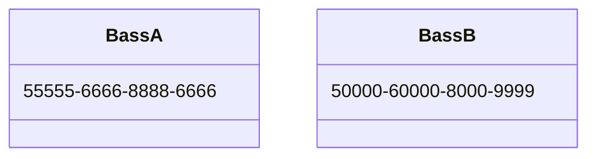
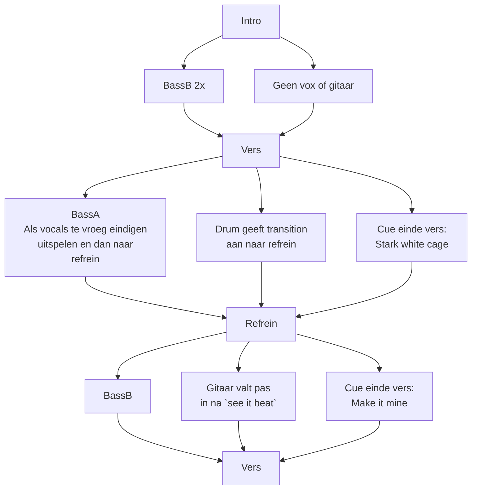

# Vivisection

```mermaid
classDiagram
    class BassA{
      55555-6666-8888-6666
    }
    class BassB{
     50000-60000-8000-9999
    }

```

```mermaid
graph TD
    A[Intro]
    B[Vers]
    C[Refrein]
    D[Vers]
    A-->IntroBass[BassB 2x]-->B
    A-->IntroVox[Geen vox of gitaar]-->B
    B-->VersBas[BassA<br>Als vocals te vroeg eindigen<br> uitspelen en dan naar refrein]-->C
    B-->VersDrum[Drum geeft transition<br> aan naar refrein]--> C
    B-->VersVocals[Cue einde vers: <br> Stark white cage]-->C
    C-->RefreinBass[BassB]--> D
    C-->RefreinGitaar[Gitaar valt pas <br> in na `see it beat`]-->D
    C-->RefreinVocals[Cue einde vers: <br> Make it mine]-->D
```