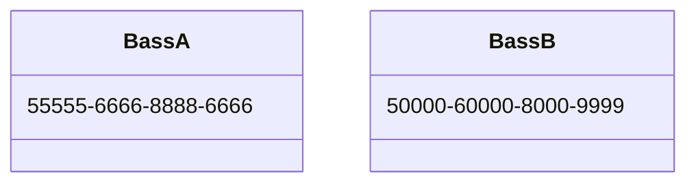
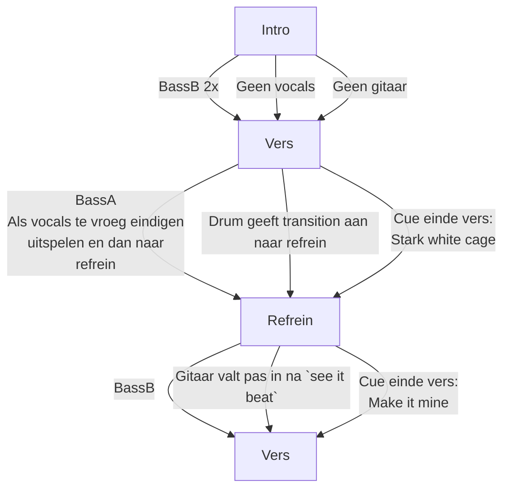

# Vivisection

```mermaid
classDiagram
    class BassA{
      55555-6666-8888-6666
    }
    class BassB{
     50000-60000-8000-9999
    }

```

```mermaid
graph TD
    A[Intro]
    B[Vers]
    C[Refrein]
    D[Vers]
    A-->|BassB 2x|B
    A-->|Geen vocals|B
    A-->|Geen gitaar|B
    B-->|BassA<br>Als vocals te vroeg eindigen<br> uitspelen en dan naar refrein|C
    B-->|Drum geeft transition aan naar refrein|C
    B-->|Cue einde vers: <br> Stark white cage|C
    C-->|BassB|D
    C-->|Gitaar valt pas in na `see it beat`|D
    C-->|Cue einde vers: <br> Make it mine|D
```