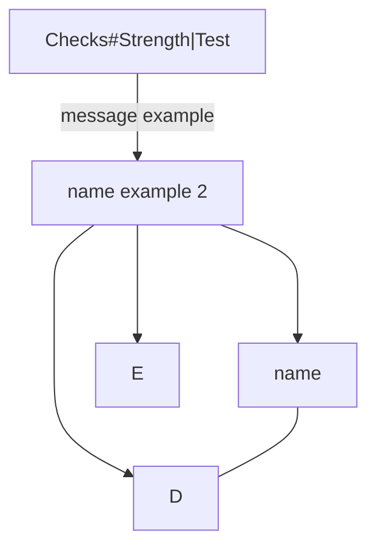

```mermaid
%% example of a named node: A[Named Node] only has to be declared once
%% arrow -->
%% line ---
%% 2 sided arrow <-->
%% message in middle of connection |message|;
%% TB = top to bottom, BT = bottom to top, LR = Left to right RL = right left 
%% Class A,B,C,D internal-link
%% has to have the same name as the target link
graph TD
	A["Checks#Strength|Test"]
	B[name example 2]
	C[name]
	A-->|message example|B
	B ---> D & C & E
	C --- D	
class A internal-link
```
